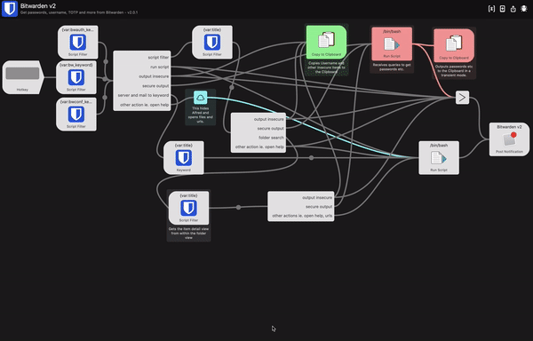
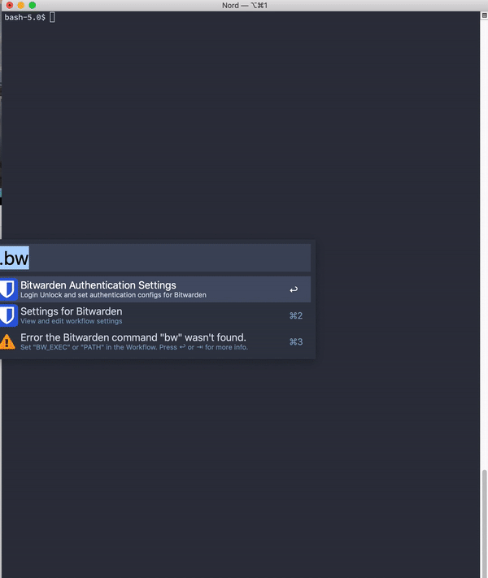
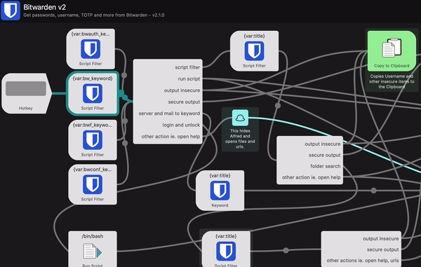
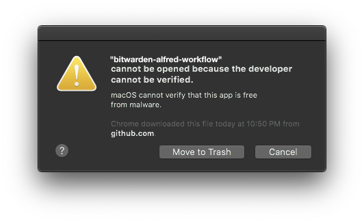

# Bitwarden Alfred Workflow

> Access your Bitwarden passwords, secrets, attachments and more via this powerful Alfred Workflow

# Table of contents

- [Bitwarden Alfred Workflow](#bitwarden-alfred-workflow)
  - [Features](#features)
  - [Installation](#installation)
  - [PATH configuration](#path-configuration)
  - [Usage](#usage)
  - [Login via APIKEY](#login-via-apikey)
  - [Search- / Filtermode](#search---filtermode)
  - [Enable auto background sync](#enable-auto-background-sync)
  - [Enable auto lock](#enable-auto-lock)
  - [Advanced Features / Configuration](#advanced-features--configuration)
  - [Modifier Actions Explained](#modifier-actions-explained)
- [Develop locally](#develop-locally)
- [Licensing and Thanks](#licensing-and-thanks)
  - [Contributors](#contributors)
  - [Source that helped me to get started](#source-that-helped-me-to-get-started)
- [Troubleshooting](#troubleshooting)

## Features

* Completely rewritten in go
* fast secret / item search thanks to caching (no secrets are cached only the keys/names)
  * cache is encrypted
* access to (almost) all object information via this workflow
* download attachments via this workflow
* show favicons of the websites
* auto update
* auto Bitwarden sync in the background
* auto lock on startup and after customizable idle time
* uses the [awgo](https://pkg.go.dev/github.com/deanishe/awgo?tab=doc) framework/library
* many customizations possible

> Requires Alfred 4.1 or newer; NOT tested with Alfred 3

## Installation
- [Download the latest release](https://github.com/blacs30/bitwarden-alfred-workflow/releases)
- Open the downloaded file in Finder
- Make sure that the [Bitwarden CLI](https://github.com/bitwarden/cli#downloadinstall) version 1.19 or newer is installed
- If running on macOS Catalina or later, you _**MUST**_ add Alfred to the list of security exceptions for running unsigned software. See [this guide](https://github.com/deanishe/awgo/wiki/Catalina) for instructions on how to do this.
  - Yes, this sucks and is annoying, but there is unfortunately is no easy way around this. macOS requires a paying Developer account for proper app notarization. I'm afraid I'm not willing to pay a yearly subscription fee to Apple just so that this (free and open source) project doesn't pester macOS Gatekeeper.

## PATH configuration

In many cases the bw and node executables are located in paths outside of the default system PATH. 
Please configure the Alfred Worklow variables PATH accordingly. 
In a normal terminal type `which bw` and copy the dirname (everything except the "bw") into the PATH workflow variable. 
The best is to append it to the existing string and separate it by a colon (:) 
Repeat the above steps for node, starting with `which node`.

## Usage
To use, activate Alfred and type `.bw` to trigger this workflow. From there:

- type `.bwauth` for login/logout/unlock/lock
- type `.bwconfig` for settings/sync/workflow update/help/issue reports
- type any search term to search for secrets/notes/identities/cards
- modifier keys and actions are presented in the subtitle, different actions are available depending on the object type

## Login via APIKEY
Since version 2.4.1 the workflow supports login via the api key. 
Get/create an api key via the web ui. See more information here [https://bitwarden.com/help/article/cli/#using-an-api-key](https://bitwarden.com/help/article/cli/#using-an-api-key) 
To use the api key login flow in the workflow set the workflow variable `USE_APIKEY` to true. 
The workflow will then ask you for the client_id and client secret to login. 
Immediately afterwards it will also ask to unlock with the master password to get a session key.  
That is a separate step and required with the api key as login method.

## Search- / Filtermode

Up to version < 2.1.0 the *Fuzzy filtering a la Sublime Text* was default. Starting with version 2.1.0 Alfreds internal filtering is default.

You can change the search-/filtermode yourself easily. This gif shows the 3 steps which need to be done for it:

## Enable auto background sync

In version 2.3.0 the background sync mechanism was added. 
It is using the macOS user LaunchAgent.

To install the sync configure the workflow variables:

- `AUTOSYNC_TIMES`, this can be used to configure comma separated multiple sync times per day, e.g. `8:15,23:45`
- alternatively you can use `AUTO_HOUR` together with `AUTO_MIN` for only one sync time

Bitwarden needs to be unlocked for sync to work.

Install via Alfred keyword: `.bwauto`

## Enable auto lock

In version 2.3.0 the background lock and lock on startup mechanism was added. 
It is using the macOS user LaunchAgent.

To install the sync configure the workflow variables:

- `LOCK_TIMEOUT` set to a time in minutes after which the workflow should be locked if it hasn't been used in the meantime

The LaunchAgent checks every 5 minutes if the lock timeout has been reached.

The LaunchAgent checks also on load (e.g. startup of the system and login of the user), 
if the startup happened within the last 5 minutes, if so then it locks the Bitwarden workflow.

Install via Alfred keyword: `.bwautolock`

## Advanced Features / Configuration

- Configurable [workflow environment variables](https://www.alfredapp.com/help/workflows/advanced/variables/#environment)

| Name                      | Comment                                                                                                                                                                                                                                                                                                                                                                          | Default Value                                                                       |
|---------------------------|----------------------------------------------------------------------------------------------------------------------------------------------------------------------------------------------------------------------------------------------------------------------------------------------------------------------------------------------------------------------------------|-------------------------------------------------------------------------------------|
| 2FA_ENABLED               | enables or disables 2FA for login (can be set via .bwconfig )                                                                                                                                                                                                                                                                                                                    | true                                                                                |
| 2FA_MODE                  | sets the mode for the 2FA (can be set via .bwconfig ), 0 authenticator app, 1, email, 3 yubikey otp ; not used when APIKEYS are used to login                                                                                                                                                                                                                                    | 0                                                                                   |
| AUTO_HOUR                 | sets the hour for the backround sync to run (is installed separately with .bwauto)                                                                                                                                                                                                                                                                                               | 10                                                                                  |
| AUTO_MIN                  | sets the minute for the backround sync to run (is installed separately with .bwauto)                                                                                                                                                                                                                                                                                             | 0                                                                                   |
| AUTOSYNC_TIMES            | sets multiple times when bitwarden should sync with the server, this is used first and instead of AUTO_MIN and AUTO_HOUR                                                                                                                                                                                                                                                         | 8:15,23:45                                                                          |
| AUTO_FETCH_ICON_CACHE_AGE | This defines how often the Workflow should check for an icon if is missing, it doesn't need to do it on every run hence this cache                                                                                                                                                                                                                                               | 1440 (1 day)                                                                        |
| BW_EXEC                   | defines the binary/executable for the Bitwarden CLI command                                                                                                                                                                                                                                                                                                                      | bw                                                                                  |
| BW_DATA_PATH              | sets the path to the Bitwarden Cli data.json                                                                                                                                                                                                                                                                                                                                     | "~/Library/Application Support/Bitwarden CLI/data.json""                            |
| bw_keyword                | defines the keyword which opens the Bitwarden Alfred Workflow                                                                                                                                                                                                                                                                                                                    | .bw                                                                                 |
| bwf_keyword               | defines the keyword which opens the folder search of the Bitwarden Alfred Workflow                                                                                                                                                                                                                                                                                               | .bwf                                                                                |
| bwauth_keyword            | defines the keyword which opens the Bitwarden authentications of the Alfred Workflow                                                                                                                                                                                                                                                                                             | .bwauth                                                                             |
| bwauto_keyword            | defines the keyword which opens the Bitwarden background sync agent                                                                                                                                                                                                                                                                                                              | .bwauto                                                                             |
| bwautolock_keyword        | defines the keyword which opens the Bitwarden background lock agent                                                                                                                                                                                                                                                                                                              | .bwautolock                                                                         |
| bwconf_keyword            | defines the keyword which opens the Bitwarden configuration/settings of the Alfred Workflow                                                                                                                                                                                                                                                                                      | .bwconfig                                                                           |
| DEBUG                     | If enabled print additional debug information, specially about for the decryption process                                                                                                                                                                                                                                                                                        | false                                                                               |
| EMAIL                     | the email which to use for the login via the Bitwarden CLI, will be read from the data.json of the Bitwarden CLI if present                                                                                                                                                                                                                                                      | ""                                                                                  |
| EMAIL_MAX_WAIT            | For the email 2fa we trigger a process so that Bitwarden sends the email. Then we kill that process after timeout x is reached. This sets how long the process should wait before it is cancelled because if cancelled too early no email is send but waiting too long is annoying.                                                                                              | 15                                                                                  |
| EMPTY_DETAIL_RESULTS      | Show all information in the detail view, also if the content is empty                                                                                                                                                                                                                                                                                                            | false                                                                               |
| ICON_CACHE_ENABLED        | Download icons for login items if a URL is set                                                                                                                                                                                                                                                                                                                                   | true                                                                                |
| ICON_CACHE_AGE            | This defines how old the icon cache can get in minutes, if expired the Workflow will download icons again. If icons are missing the workflow will also try to download them unrelated to this timeout                                                                                                                                                                            | 43200 (1 month)                                                                     |
| LOCK_TIMEOUT              | Besides the lock on startup this additional timeout is set to define when Bitwarden should be locked in case of no usage.                                                                                                                                                                                                                                                        | 1440 (1 day)                                                                        |
| MAX_RESULTS               | The number of items to display maximal in the search view                                                                                                                                                                                                                                                                                                                        | 1000                                                                                |
| MODIFIER_1                | The first modifier key combination, possible options, which can be combined by comma separation, are "cmd,alt/opt,ctrl,shift,fn"                                                                                                                                                                                                                                                 | alt                                                                                 |
| MODIFIER_2                | The first modifier key combination, possible options, which can be combined by comma separation, are "cmd,alt/opt,ctrl,shift,fn"                                                                                                                                                                                                                                                 | shift                                                                               |
| MODIFIER_3                | The first modifier key combination, possible options, which can be combined by comma separation, are "cmd,alt/opt,ctrl,shift,fn"                                                                                                                                                                                                                                                 | ctrl                                                                                |
| MODIFIER_4                | The first modifier key combination, possible options, which can be combined by comma separation, are "cmd,alt/opt,ctrl,shift,fn"                                                                                                                                                                                                                                                 | cmd,opt                                                                             |
| MODIFIER_5                | The first modifier key combination, possible options, which can be combined by comma separation, are "cmd,alt/opt,ctrl,shift,fn"                                                                                                                                                                                                                                                 | cmd,shift                                                                             |
| MODIFIER_1_ACTION         | Action executed by the first modifier                                                                                                                                                                                                                                                                                                                                            | username,code                                                                       |
| MODIFIER_2_ACTION         | Action executed by the second modifier                                                                                                                                                                                                                                                                                                                                           | url                                                                                 |
| MODIFIER_3_ACTION         | Action executed by the third modifier                                                                                                                                                                                                                                                                                                                                            | totp                                                                                |
| MODIFIER_4_ACTION         | Action executed by the fourth modifier                                                                                                                                                                                                                                                                                                                                           | more                                                                                |
| MODIFIER_5_ACTION         | Action executed by the fifth modifier                                                                                                                                                                                                                                                                                                                                           | webui                                                                                |
| NO_MODIFIER_ACTION        | Action executed without modifier pressed                                                                                                                                                                                                                                                                                                                                         | password,card                                                                       |
| OPEN_LOGIN_URL            | If set to false the url of an item will be copied to the clipboard, otherwise it will be opened in the default browser.                                                                                                                                                                                                                                                          | true                                                                                |
| OUTPUT_FOLDER             | The folder to which attachments should be saved when the action is triggered. Default is \$HOME/Downloads. "~" can be used as well.                                                                                                                                                                                                                                              | ""                                                                                  |
| PATH                      | The PATH env variable which is used to search for executables (like the Bitwarden CLI configured with BW_EXEC, security to get and set keychain objects)                                                                                                                                                                                                                         | /usr/bin:/usr/local/bin:/usr/local/sbin:/usr/local/share/npm/bin:/usr/bin:/usr/sbin |
| REORDERING_DISABLED       | If set to false the items which are often selected appear further up in the results.                                                                                                                                                                                                                                                                                             | true                                                                                |
| SERVER_URL                | Set the server url if you host your own Bitwarden instance - you can also set separate domains for api,webvault etc e.g. `--api http://localhost:4000 --identity http://localhost:33656`                                                                                                                                                                                         | https://bitwarden.com                                                               |
| SKIP_TYPES                | Comma separated list of types which should not be listed in the Workflow. Clear the Workflow cache and sync again (in .bwconf ) Available types to skip: (login, note, card, identity)                                                                                                                                                                                           | ""                                                                                  |
| TITLE_WITH_USER           | If enabled the name of the login user item or the last 4 numbers of the card number will be appended (added) at the end of the name of the item                                                                                                                                                                                                                                  | true                                                                                |
| TITLE_WITH_URLS           | If enabled all the URLs for an login item will be appended (added) at the end of the name of the item                                                                                                                                                                                                                                                                            | true                                                                                |
| USE_APIKEY                | If enabled an API KEY can be used to login, this is helpful to prevent problems with captches which Bitwarden cloud introduced recently https://bitwarden.com/help/article/cli/#using-an-api-key ; Second Factor will not be used when APIKEYS are used. After the login with APIKEYS an unlock with the master password is required - the workflow asks automatically to unlock | false                                                                               |
| WEBUI_URL                | Set the Web UI vault url if you host your own Bitwarden instance - you can also set separate domains for api,webvault etc e.g. `--api http://localhost:4000 --identity http://localhost:33656`                                                                                                                                                                                         | https://vault.bitwarden.com                                                               |

## Modifier Actions Explained

| type     | action name                     |
|----------|---------------------------------|
| login    | password                        |
|          | username                        |
|          | url                             |
|          | webui                           |
|          | totp                            |
| note     | - (always copy the secret note) |
| cards    | card                            |
|          | code                            |
| identity | - (always copy the name )       |
| others   | more (to show all item entries, can't be NO_MODIFIER_ACTION) |

You can place per type *one* `action name` into the ACTION config, a combination is possible where it is *not* overlapping with `more` or another of the same type.

**Good examples:**

NO_MODIFIER_ACTION=url,code 
MODIFIER_1_ACTION=totp 
MODIFIER_2_ACTION=more 
MODIFIER_3_ACTION=password,card (2 items listed but of different *type*)

**Bad examples:**

NO_MODIFIER_ACTION=url,password 
MODIFIER_3_ACTION=code,card (2 items listed but of the same *type*, therefore this is not permitted and will cause problems)

# Develop locally

1. Install alfred cli  
`go install github.com/jason0x43/go-alfred/alfred@latest`

2. Clone [this repo](https://github.com/blacs30/bitwarden-alfred-workflow).

3. Link the workflow directory with Alfred  
`cd workflow; alfred link`

4. Install dependency and run the first build 
`make build`

### Colors and Icons

*Light blue*

Hex: #175DDC  
RGB: 23,93,220

*Darker blue*

Hex: #134db7  
RGB: 20,81,192

Get icons as pngs here https://fa2png.app/ and this is the browser https://fontawesome.com/cheatsheet

# Licensing and Thanks

The icons are based on [Bitwarden Brand](https://github.com/bitwarden/brand) , [Font Awesome](https://fontawesome.com/) and [Material Design](https://materialdesignicons.com/) Icons.

Parts of the README are taken over from [alfred-aws-console-services-workflow](https://github.com/rkoval/alfred-aws-console-services-workflow)

## Contributors

A big thanks to all code contributors but also to everyone who creates issues and helps that this workflow matures.

- @luckman212
- @blacs30

> Though this repository was a fork, it has 0 code reference anymore to the forked repo
> because of watchers and stars I decided to leave it this way and not to "unlink" it - by creating a new clean repository

## Source that helped me to get started

- [Writing Alfred workflows in Go](https://medium.com/@nikitavoloboev/writing-alfred-workflows-in-go-2a44f62dc432)
- [Example of the awgo package] (https://github.com/deanishe/awgo/blob/master/_examples/update/main.go)
- [awgo package](https://pkg.go.dev/github.com/deanishe/awgo?tab=doc)

# Troubleshooting

- "I'm seeing the following dialog when running the workflow"

  

  **Workaround:**

  Per [the installation steps](https://github.com/blacs30/bitwarden-alfred-workflow#installation), you **_MUST_** add Alfred to the list of Developer Tool exceptions for Alfred to run any workflow that contains an executable (like this one)

- Using `bw` cli and this workflow in parallel can possibly cause this error occurs `Unexpected error. Exit code -1.`

  The reason for that is when the `bw` cli is used in the terminal and the password is entered that a new session is initiated and the workflow's session invalidated.

  **Workaround:**

  You can use the bash functions created by @luckman212 and located [here in github](https://github.com/luckman212/bitwarden-cli-helpers) 
  Download the bash file and source it in your own `.bash_profile` or `.zshrc`

- Getting a secret still takes very much time

  With version 2.2.0 this workflow decrypts the secrets without using the `bw` cli. This is much faster but it might possibly can fail. 
  If it fails it falls back and uses the `bw` cli to get the secret. The decryption takes then more time again, was in the previous versions. 

  **Workaround:**

  To use the workflows faster decryption you can [follow this instruction by Bitwarden](https://bitwarden.com/help/article/update-encryption-key/))  
  to update the encryption keys to the new mechanism.

  The linked doc doesn't specify how to force creation of a new key. It's easy though:

  - Login to your vault.
  - Click Settings at the top of the page.
  - Under My Account, scroll down to Encryption Key Settings.
  - Follow the instructions provided.
  - Logout (and on again) from Bitwarden on all devices.
